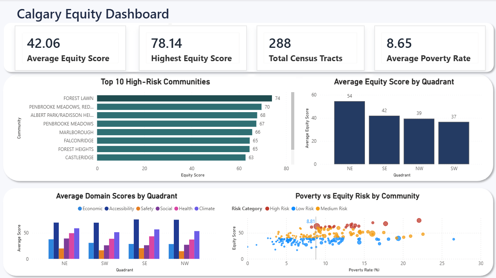
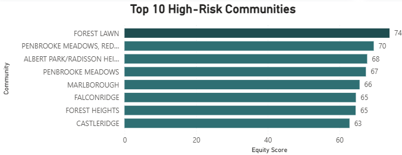
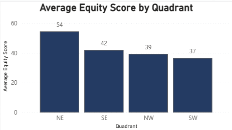
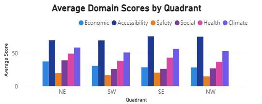
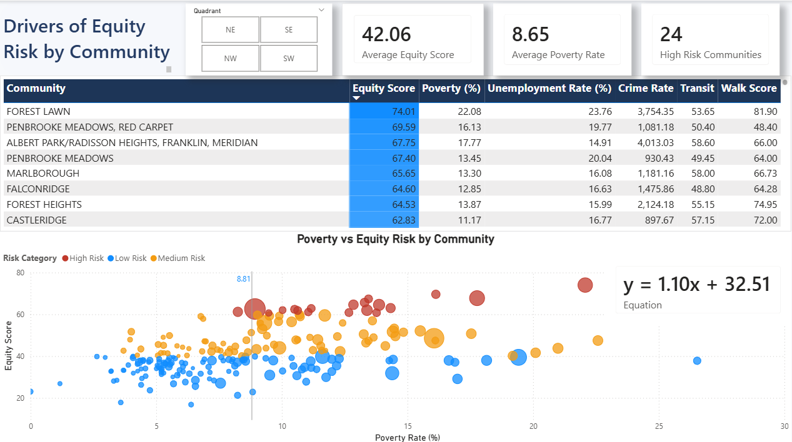
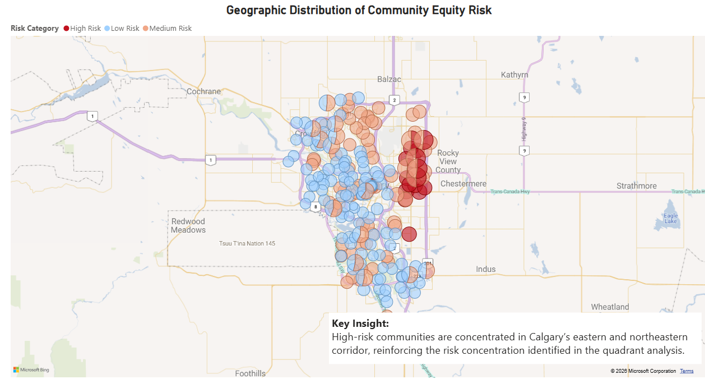

# Calgary Equity Index Analysis

## Project Overview
This project analyzes the 2024 Calgary Equity Index dataset from Calgary Open Data to identify high-risk communities, quadrant-level inequity, and key drivers of inequity across Calgary.

The analysis was completed using Power BI and focuses on helping city planners, community service teams, and policy stakeholders understand where interventions and resources may be needed most.

## Tools Used
- Power BI
- Power Query
- DAX
- Excel
- Calgary Open Data

## Business Questions
1. Which communities in Calgary have the highest equity risk?
2. Which quadrant of Calgary experiences the greatest overall inequity?
3. Which domain indicators contribute most significantly to inequity across Calgary quadrants?
4. Is there a relationship between poverty and total equity risk at the community level?

## Dashboard Preview

### Full Dashboard Overview

---

### Top 10 High Risk Communities

---

### Equity Score by Quadrant

---

### Domain Scores by Quadrant

---

### Poverty vs Equity Score Analysis

---

### Geographical Community View

